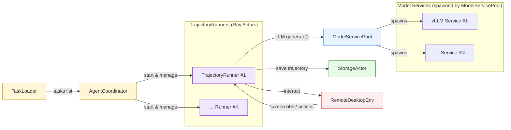
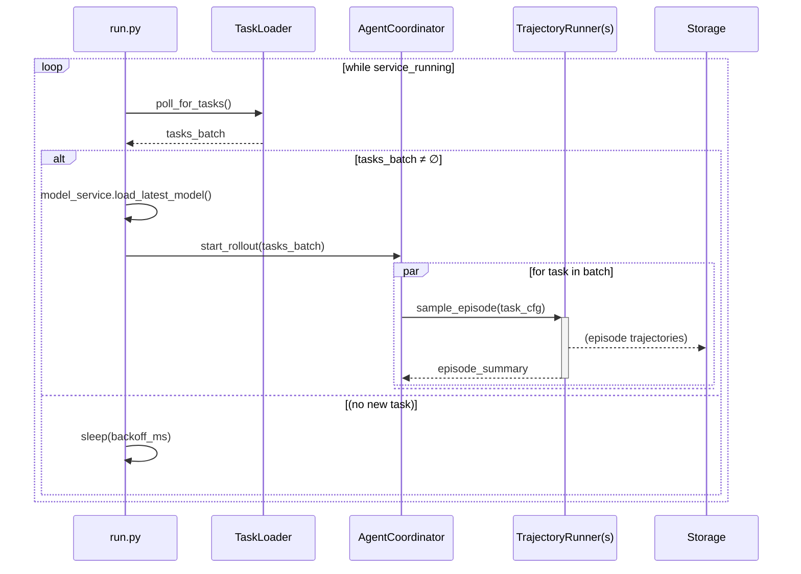
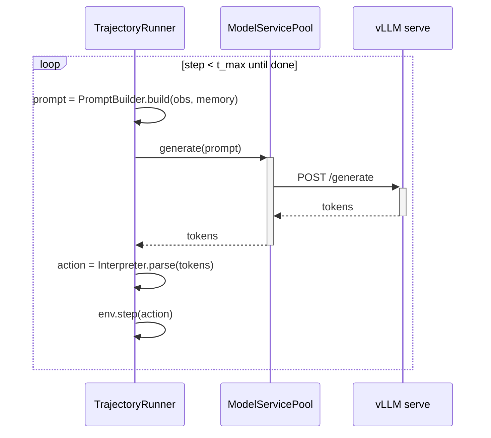

# computer-use-rollout

## Graphs

### Architecture diagram

###  setup python env 
bash scripts/setup_env.sh





### Sequence diagram

* Service-level



* Episode-level



```text
├── agent_coordinator.py      # 控制器：将任务加入队列（= 并行环境数量），并行启动 TrajectoryRunner，任务完成后持续补充队列
├── env_k8s.py                # 环境类：搬运自 verl 项目，修复了一些 bug
├── model_service_pool.py     # 模型类：启动 vllm serve，提供 generate 方法生成 response
├── prompts.py                # Prompt：搬运自 verl 项目
├── storage_actor.py          # 存储类：实现异步 IO，保存轨迹信息
├── task_loader.py            # 数据加载类：读取任务列表 JSON，并加载具体的 task config 信息
├── trajectory_runner.py      # 核心方法：参考 run_agent_loop，实现 agent 与 env 交互
├── ui_tars_utils.py          # 工具：将模型 response 处理成 action，搬运自 verl 项目
├── run_model.py              # 启动模型：先运行此脚本，等待模型全部加载成功（约 5 分钟）
├── run.py                    # 主流程：程序入口，参数在 config 中设置
│
├── scripts
│   ├── compare_exp_result.py       # 比较两次实验结果，保存 reward 不一致的任务
│   ├── experiment_result_stats.py  # 统计多个结果文件，计算每次成功率与总成功率
│   ├── show_result.py              # 统计单次实验结果
│   └── test_4999.ipynb             # 查看环境状态，手动释放环境等
│
└── tests
    ├── cleanup_gpu_mem.py          # 清理显存（曾出现程序停止后显存未释放的情况，已修复）
    ├── gpt_demo.py                 # vllm serve 模型单条测试
    └── test_local_model.py         # 本地加载模型单条测试
```